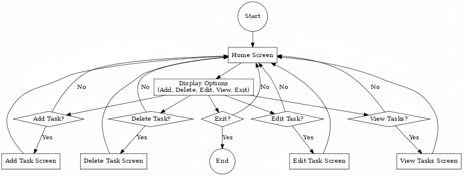

# Taskmaster - A Simple Python To-Do List CLI Application

**Taskmaster** is a lightweight and user-friendly command-line to-do list application written in Python. This project is perfect for anyone looking to manage their tasks in a simple, text-based environment.

## Features
- **Add Tasks**: Create tasks with a title and description.
- **Delete Tasks**: Remove tasks from the list by selecting their index.
- **Edit Tasks**: Update the title or description of existing tasks.
- **View Tasks**: Display all tasks with their completion status.
- **Exit**: Gracefully close the application.

## How It Works
1. When you run the application, you'll see a menu with options to add, delete, edit, view, or exit.
2. Choose an option by entering the corresponding number.
3. Follow the prompts to manage your tasks effectively.

## Flowchart
The below flowchart represents the program's workflow:

